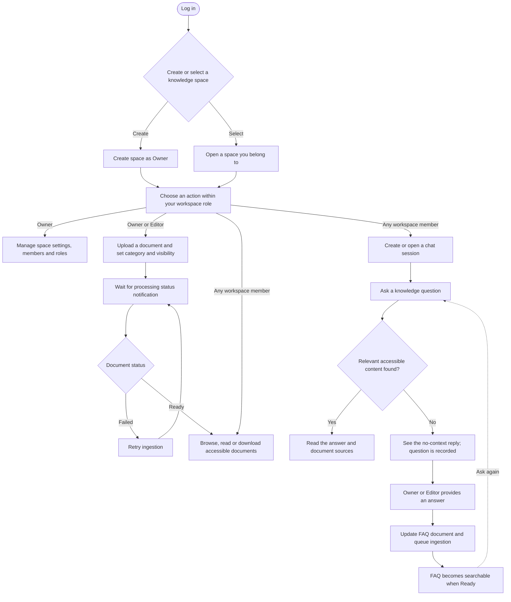
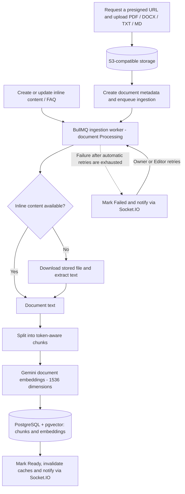
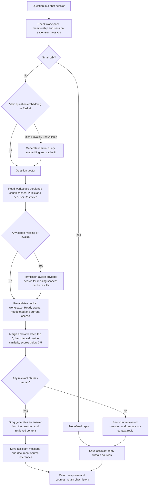

# Smart Knowledge Hub Backend 🧠

Smart Knowledge Hub is a **NestJS 11 and TypeScript backend** for a multi-workspace, AI-assisted knowledge base. Teams upload documents, control who can access them, and ask questions through a **retrieval-augmented generation (RAG)** chat flow that returns answers with document sources.

## Core features ✨

- **Knowledge spaces and role-based access control (RBAC):** Manage spaces and members with Owner, Editor, and Viewer roles. JWT guards protect API routes, while document visibility and per-user permissions restrict access to individual files and retrieved content.
- **Document management:** Organize files by category; request presigned upload and download URLs for S3-compatible object storage; create, update, and browse PDF, DOCX, TXT, and Markdown documents.
- **Asynchronous document ingestion:** BullMQ workers extract text, split it into token-aware chunks, generate 1,536-dimensional Gemini embeddings, and store them in PostgreSQL with pgvector. Processing status moves to Ready or Failed, with real-time Socket.IO notifications.
- **Permission-aware RAG chat:** Embed a question, search the caller's accessible Ready documents by cosine similarity, pass relevant chunks to Groq for answer generation, and attach source references to the answer. Users can manage chat sessions and message history.
- **Unanswered-question workflow:** Record questions without relevant document content and resolve them into a workspace FAQ document that is queued for ingestion.
- **Caching:** Redis caches paginated document lists, exact-match question embeddings, and retrieved chunks. Chunk caches are versioned per workspace, with separate Public and per-user Restricted scopes; retrieved chunks are revalidated against current document status and permissions before use.
- **Accounts and notifications:** JWT login and refresh tokens, OTP-based password recovery, email jobs, and Redis-backed WebSocket notifications.

## Core technologies 🛠️

- **Backend and API:** NestJS 11, TypeScript, REST APIs, OpenAPI/Swagger, class-validator, JWT authentication, guards, and centralized exception handling.
- **Data and search:** PostgreSQL, Prisma ORM 7, pgvector, SQL vector similarity search, and a split Prisma schema under `prisma/models/`.
- **AI and RAG:** Gemini embeddings, Groq LLM, token-aware chunking, retrieval with source attribution, and PDF/DOCX text extraction.
- **Async and real time:** Redis, BullMQ workers, Socket.IO, Redis Socket.IO adapter, and Bull Board in non-production environments.
- **Storage and delivery:** S3-compatible object storage (including Cloudflare R2), presigned URLs, Jest, ESLint, Prettier, and GitHub Actions CI.

## User flow

The diagrams use Mermaid and render directly on GitHub. Workspace roles are cumulative: Owners can also perform Editor and Viewer actions; Editors can also perform Viewer actions. Public documents are accessible to workspace members, while Restricted documents require an explicit document permission.



## How the RAG flow works

### Document ingestion

Uploaded files and inline document content (including resolved FAQ entries) share the same chunking and embedding pipeline.



### Question retrieval and answer generation

Knowledge questions use cached embeddings and retrieved chunks where available. Small-talk messages receive a predefined reply without invoking RAG.



Redis caches embeddings and retrieved chunks, not generated answers. Public chunk caches are shared within a workspace; Restricted chunk caches are scoped to the requesting user. Cache hits still go through database validation before any content reaches Groq. Questions without relevant content are recorded for the Owner/Editor FAQ resolution workflow shown above.

## Architecture

Features are organized as NestJS modules under `src/modules/`. Each module separates `api/` controllers, `application/` services and DTOs, `domain/` entities and repository contracts, and `infrastructure/` persistence or external clients. Shared guards, caching, database access, queues, storage, and notifications live under `src/shared/`.

```text
src/modules/
  auth/             JWT authentication, refresh tokens, OTP recovery
  user/             user profiles
  knowledge-space/  workspaces, membership, roles
  category/         document categories
  document/         files, permissions, document-list cache
  rag/              ingestion, embeddings, vector retrieval
  chat/             sessions, messages, answers, unanswered questions
src/shared/
  common/           guards, validation, errors, middleware
  infrastructure/   Prisma, Redis cache, BullMQ, storage, notifications
prisma/
  schema.prisma     generator and datasource
  models/           feature models merged by Prisma
  migrations/       database migrations, including pgvector setup
```

Prisma models use an internal integer `id` for relations and a UUID `publicId` in external APIs. Application and domain operations use `neverthrow` results for explicit success and error handling.

## Getting started 🚀

Use Node.js 24, PostgreSQL with the `pgvector` extension, and Redis. Configure the database, S3-compatible storage, Gemini, Groq, JWT, and SMTP values in `.env` using `.env.example` as the reference.

```bash
npm ci
cp .env.example .env
npx prisma generate
npx prisma migrate deploy
npm run start:dev
```

The API runs at `http://localhost:3000`; Swagger UI is at `http://localhost:3000/docs`. Bull Board is available at `/admin/queues` outside production. `DIRECT_URL` is used by the Prisma CLI and falls back to `DATABASE_URL` when unset. Re-run `npx prisma generate` after any schema change because `generated/prisma/` is not committed.

## Verification and CI ✅

```bash
npm run build
npm run lint
npm test
npm run test:e2e
```

Run a focused unit test with `npm test -- path/to/file.spec.ts`. GitHub Actions installs dependencies, generates the Prisma client, runs ESLint, and builds the application on pushes and pull requests to `develop` and `main`.
